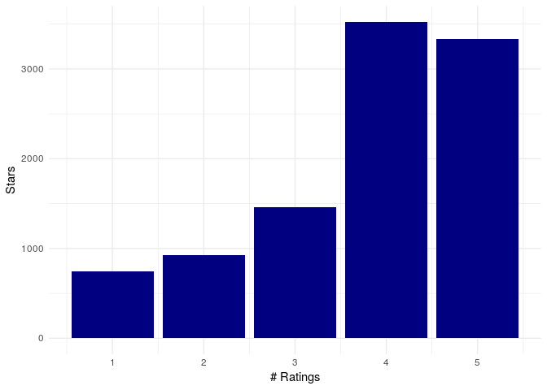
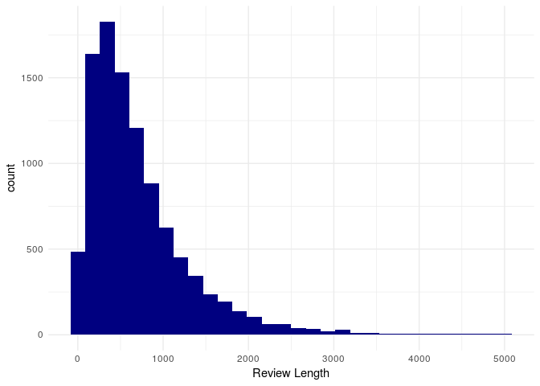
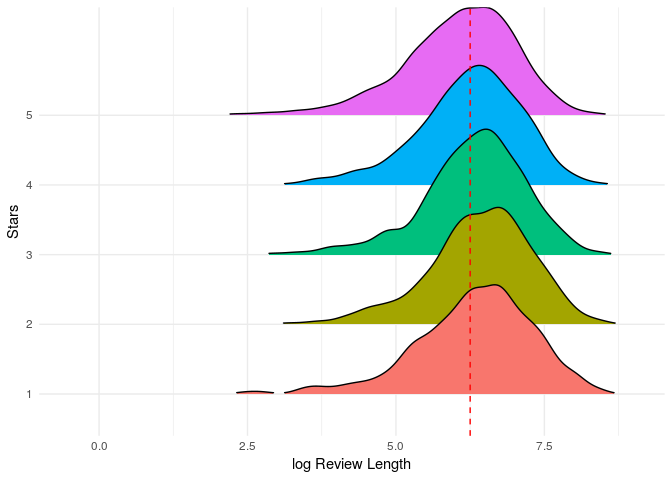
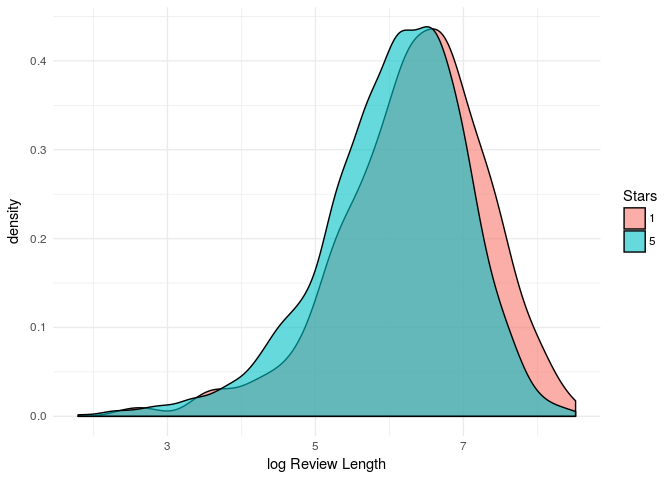

Yelp - NLP
================

``` r
knitr::opts_chunk$set(echo = TRUE)

library(data.table)
library(ggplot2)
library(dplyr)
library(reshape2)
library(ggridges)
library(tm)
library(stopwords)
library(purrr)

yelp <- fread("/media/ddantas/OS/udemy/PythonDataScience/Python-Data-Science-and-Machine-Learning-Bootcamp/Machine Learning Sections/Natural-Language-Processing/yelp.csv")
```

Yelp Data Set
-------------

This dataset contains reviews information such as the rating, date of review and the text.

``` r
str(yelp)
```

    ## Classes 'data.table' and 'data.frame':   10000 obs. of  10 variables:
    ##  $ business_id: chr  "9yKzy9PApeiPPOUJEtnvkg" "ZRJwVLyzEJq1VAihDhYiow" "6oRAC4uyJCsJl1X0WZpVSA" "_1QQZuf4zZOyFCvXc0o6Vg" ...
    ##  $ date       : chr  "2011-01-26" "2011-07-27" "2012-06-14" "2010-05-27" ...
    ##  $ review_id  : chr  "fWKvX83p0-ka4JS3dc6E5A" "IjZ33sJrzXqU-0X6U8NwyA" "IESLBzqUCLdSzSqm0eCSxQ" "G-WvGaISbqqaMHlNnByodA" ...
    ##  $ stars      : int  5 5 4 5 5 4 5 4 4 5 ...
    ##  $ text       : chr  "My wife took me here on my birthday for breakfast and it was excellent.  The weather was perfect which made sit"| __truncated__ "I have no idea why some people give bad reviews about this place. It goes to show you, you can please everyone."| __truncated__ "love the gyro plate. Rice is so good and I also dig their candy selection :)" "Rosie, Dakota, and I LOVE Chaparral Dog Park!!! It's very convenient and surrounded by a lot of paths, a desert"| __truncated__ ...
    ##  $ type       : chr  "review" "review" "review" "review" ...
    ##  $ user_id    : chr  "rLtl8ZkDX5vH5nAx9C3q5Q" "0a2KyEL0d3Yb1V6aivbIuQ" "0hT2KtfLiobPvh6cDC8JQg" "uZetl9T0NcROGOyFfughhg" ...
    ##  $ cool       : int  2 0 0 1 0 4 7 0 0 0 ...
    ##  $ useful     : int  5 0 1 2 0 3 7 1 0 1 ...
    ##  $ funny      : int  0 0 0 0 0 1 4 0 0 0 ...
    ##  - attr(*, ".internal.selfref")=<externalptr>

### Rating Distribution

``` r
yelp%>%
  group_by(stars)%>%
  summarise(total=n())%>%
  ggplot(aes(x=stars,y=total))+
  geom_col(fill="navy")+theme_minimal()+xlab("# Ratings")+ylab("Stars")
```



Most of the reviews were 4 or 5 stars.

### Reviews

Below 3 examples of reviews.

``` r
yelp[23:25,text]
```

    ## [1] "first time my friend and I went there... it was delicious!  The food, garlic knots our favorite and of course the wine!  We will be going back ALOT!"                                                                                                                                                                                                                                                                                                                                                                                                                                                              
    ## [2] "U can go there n check the car out. If u wanna buy 1 there? That's wrong move! If u even want a car service from there? U made a biggest mistake of ur life!! I had 1 time asked my girlfriend to take my car there for an oil service, guess what? They ripped my girlfriend off by lying how bad my car is now. If without fixing the problem. Might bring some serious accident. Then she did what they said. 4 brand new tires, timing belt, 4 new brake pads. U know why's the worst? All of those above I had just changed 2 months before!!! What a trashy dealer is that? People, better off go somewhere!"
    ## [3] "I love this place! I have been coming here for ages.\nMy favorites: Elsa's Chicken sandwich, any of their burgers, dragon chicken wings, china's little chicken sandwich, and the hot pepper chicken sandwich. The atmosphere is always fun and the art they display is very abstract but totally cool!"

How long are these reviews?

``` r
yelp[,review_len:=nchar(text)]

ggplot(yelp,aes(x=review_len))+
  geom_histogram(fill="navy")+theme_minimal()+xlab("Review Length")
```



Most of them are lower than 1k characters.

### Very Short Reviews

Example of very short reviews.

``` r
yelp[review_len<15,text]
```

    ##  [1] "Love Krista!"   "Great service"  "No good"        "D-scust-ing."  
    ##  [5] "Good food"      "Great Job!"     "Super!"         "Awesome!!!"    
    ##  [9] "Great service"  "Intense!"       "Great help!"    "Very bad food!"
    ## [13] "Just don't."    "Excellent."     "Excellent"      "Good works"    
    ## [17] "Great sandwich" "Awesome pool."  "X"              "Best in town!!"
    ## [21] "Go"             "Fun dive bar."  "Meh."           "A real gem!"   
    ## [25] "Yummy!"

Some of them are very useful though. Sometimes is better to read 'No good' or 'Excellent' than those long texts.

### The Longest Review

In this dataset the longest review have 5,003 characters. Feel free to read :p

``` r
cat(yelp[review_len==5003,text])
```

    ## In our continuing quest to identify cool, locally owned places to eat and/or drink, Caroline and I auditioned Vintage 95 last night. 
    ## 
    ## Before I go further, understand that whenever I go out for eats or drinks, I have  in  mind a Platonic Ideal of the Bar/Pub/Eatery I most want to frequent. I'm on a constant quest to find that  Ideal expressed in Real Life. 
    ## 
    ## Vintage 95 isn't quite there, but it's damn close. If I ever give something Five Stars, you'll know it has pegged my Platonic Ideal. Anyway...
    ## 
    ## The plan last night was for drinks. No plans for food, just Adult Beverages and warm conversation. But it turned into more.
    ## 
    ## The location in downtown Chandler is terrific for us. The owners have created a very fine visual experience - leather, stone, dark woods, good lighting. And they don't have the music turned up so loud that you CANNOT HAVE A CONVERSATION. This is one of my pet peeves. If I want to stare at people move their mouths while enduring an aural assault, I'll stand on the deck of an aircraft carrier. When I go out with friends, I want to enjoy their company AND their conversation. Is that concept so difficult to grasp? [/rant off]
    ## 
    ## The atmosphere at Vintage 95 is very close to my Ideal. I'd go back just to sit on the leather couches in front of the fireplace, and then go back another time to sit on the leather stools at the bar, and then go back about fourteen more times to sit out on the patio. Seriously - go check out the patio. It is EXACTLY what a Patio Hangout Bar should be. EXACTLY.
    ## 
    ## Caroline and I told the hostesses we were only there for drinks, so we were seated in the bar area in some fabulous leather club chairs. It wasn't initmate, but we weren't looking for intimate. And speaking of the bar, even though V95 advertises itself as a wine bar, they DO have booze. I'm not much of a wine drinker and was very pleased to see that they carried a pretty good selection of single malt scotches. Not an overwhelming selection, but well beyond the normal Glenfiddich /Glenlivit /GlenMorangie trio to which most places are limited. I had a couple of drums of Ardbeg, which is one of my new favorites and very reasonably priced at retail. (Scotch is never reasonably priced in restaurants, but I was celebrating so I didn't care.) Caroline had her normal ""vodka martini extra dirty extra cold"" which she judged to have ""perfect dirtiness"", (no wonder I love her!), perfect amount of olives and very cold. 
    ## 
    ## The limited Happy Hour menu had some very interesting choices. We settled on the bruschetta and the smoked tomato bisque. The bruschetta was VERY nice and quite unusual. You get to select four of eight choices for your bruschetta platter; we picked: (1) white bean and pancetta, (2) gravlax, caper goat cheese and pickled onions, (3) fig chutney, ricotta and prosciutto, (4) brie, pear and onion jam. They were all served cold, in nice sized portions and the flavors were all nicely balanced and very interesting. Caroline would have preferred the bread to not be so crispy, but I really liked it. The tomato bisque  was creamy, smoky and had well-balanced flavor. Caroline said it was unique and I say it was just darn delicious. 
    ## 
    ## Things being as they are, drinks and appetizers turned into food. A friend had told us ""you have to try the Vintage burger"", so we did. It came served with a mixture of regular and sweet potato fries, all nicely cooked and nicely seasoned. Recommended. The burger was VERY tasty. They obviously use good beef, the bun was fresh, the fixin's were tasty. HIGHLY recommended.
    ## 
    ## In for a dime, in for a dollar, right? So we ordered dessert. Again, the dessert menu is short, but I'm okay with that as long as they do it well. Chocolate torte with hazelnut gelato, apple pie with carmel sauce and creme fraiche gelato, and something else we couldn't remember. I'm allergic to hazelnut and don't like sweet desserts, so we decided to try the apple pie.
    ## 
    ## Like everything else we had sampled, the apple pie was unusual - you wouldn't find it anywhere else. It was served on a freshly baked puff pastry, cubed apples served on top and inside - tender but not mushy -  with lots of cinnamon and sugar, plate was swirled with salted dolce la leche. It was tasty, but instead of the expected creme fraiche gelato, we were served hazelnut gelato. I didn't realize it was hazelnut until I'd had a couple of bites and my throat started to swell up.
    ## 
    ## At this point that the night could have turned into a disaster, but to their credit - it didn't. We told the waiter who told the manager, (Gavin - one of the owners), who immediately came and asked if I needed emergency assistance. I didn't, I'm not THAT allergic.)  Frankly, their response was EXACTLY the kind of customer service you want to see. Anyone can make a mistake, so no harm, no foul. But I must give BIG Kudos to Gavin for his kindness, attention to detail and outstanding customer service.
    ## 
    ## We will DEFINTELY be back and I strongly recommend you put it on your list too.

### The Length by Rating

``` r
# yelp%>%
# ggplot(aes(x=log(review_len), group=as.factor(stars)))+
#   geom_density(aes(fill=as.factor(stars)),alpha=0.6)+
#   theme_minimal()+guides(fill=guide_legend(title="Stars"))+xlab("log Review Length")

yelp%>%
ggplot(aes(x=log(review_len), y=as.factor(stars)))+
  geom_density_ridges(rel_min_height = 0.01,aes(fill=as.factor(stars)))+
  geom_vline(xintercept = 6.25, lty=2, colour="red")+
  theme_minimal()+ylab("Stars")+xlab("log Review Length")+guides(fill=FALSE)
```



``` r
yelp[stars%in%c(1,5)]%>%
ggplot(aes(x=log(review_len), group=as.factor(stars)))+
  geom_density(aes(fill=as.factor(stars)),alpha=0.6)+
  theme_minimal()+guides(fill=guide_legend(title="Stars"))+xlab("log Review Length")
```



It seems that 5 stars ratings tend to have slightly less characters than others.

It seems that longer text have a slightly tendency to be a 1 star review. But I don't think it would be useful. Let's see though.

### Text processing

-   Convert letters to lowercase.
-   Remove punctuation and *stopwords*.

``` r
# Remove punctuation
yelp[,text2:=tolower(gsub("[[:punct:]]","",text))]

# Remove stopwords
t<-unlist(
  map(
    as.list(yelp[,text2]),
    ~tm_map(Corpus(VectorSource(.x)),removeWords,stopwords())[[1]]$content
    )
)

yelp[,text2:=t]
```

### Text analysis

Let's start very simple. Only analyzing the presence of word "good".

``` r
yelp[,good:=grepl("good", text,ignore.case = TRUE)]

yelp%>%
  group_by(good)%>%
  summarise(total=n())
```

    ## # A tibble: 2 x 2
    ##   good  total
    ##   <lgl> <int>
    ## 1 F      5689
    ## 2 T      4311

``` r
dcast(yelp%>%
  group_by(stars)%>%
  mutate(total_stars=n())%>%
  group_by(stars,good)%>%
  summarise(total=round(100*n()/mean(total_stars),2)),formula = stars~good)%>%
  rename(`Stars \\ Word Good`=stars)
```

    ## Using total as value column: use value.var to override.

    ##   Stars \\ Word Good FALSE  TRUE
    ## 1                  1 72.50 27.50
    ## 2                  2 55.77 44.23
    ## 3                  3 48.05 51.95
    ## 4                  4 49.66 50.34
    ## 5                  5 65.21 34.79

``` r
dcast(yelp%>%
  group_by(good)%>%
  mutate(total_good=n())%>%
  group_by(good,stars)%>%
  summarise(total=round(100*n()/mean(total_good),2)),formula = good~stars)%>%
  rename(`Word Good \\ Stars`=good)
```

    ## Using total as value column: use value.var to override.

    ##   Word Good \\ Stars    1    2     3     4     5
    ## 1              FALSE 9.54 9.09 12.34 30.78 38.25
    ## 2               TRUE 4.78 9.51 17.61 41.17 26.93
