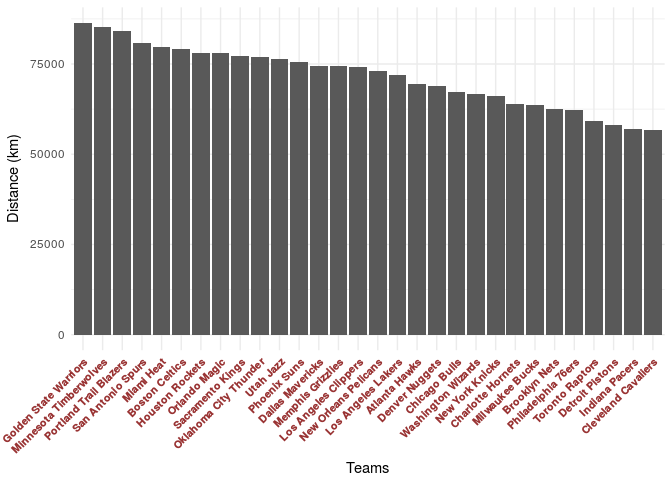
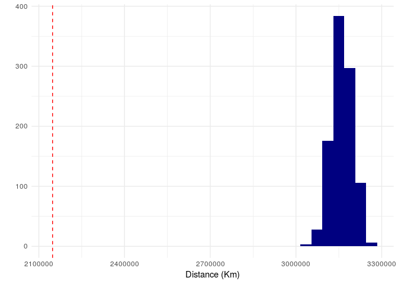

Untitled
================


Overview
========

As you might know (or not), NBA is the men's professional basketball league in US. It contains 30 teams located around US and Canada (actually there is only one team in Canada) disputing the national title every year. If you have no idea about what I am saying maybe names such as Michael Jordan, Kobe Bryant, and Stephen Curry could help you. If still it does not sounds familiar this post probably will not be as delight as it is for me, but no problem we can still learn something from here.

The tournament is divided in two phases. First, these 30 teams play against each other during what is called the regular season. In the end of the regular season the best 8 teams from each conference (East and West) advance to the Playoffs where they dispute to be the Champion.

For my application, I will only focus on the regular season, when every team are playing against each other to go to the Playoffs. During this period each team plays 82 games usually between October and April. Half of the 82 games are palyed at home and the other half is played away. It is very common for teams, during the regular season, have a sequence with more than one game away before playing at home, meaning they have to travel and stay away for more than one game.

For every regular season NBA defines a different calendar with time and location of the games. But this calendar cannot be randomly generate, otherwise we could end up with a very inefficient logistic calendar that would force teams to spend a lot of time and money on unnecessary trips. Moreover, this inefficient calendar could impact on the performance of the players.

Said that, it is plausible to claim that NBA already have an optmized regular season calendar. Where teams will not be playing away for a long period and also the amount of distance is minimized. They have an algorithm that create calendar subject to some constraints.

My point here is to explore the concept of Genetic Algorithm to create an efficient NBA calendar. Let's see!!!

Load Necessary Functions
========================

-   **collectNBACalendar**: Function to download NBA calendar for a specific year.
-   **earth.dist**: Given a pair of latitude and longitude calculate the distance between them.
-   **nbaFlightsByTeam**: Returns a data frame with flights and the distance for a specific team during the season.

These functions were created from scratch to ease the porcess to manipulate data. More information about these functions can be found at [my github account](https://github.com/ddantasds/Data-Science-Projects/blob/master/NBA%20calendar/NBA%20season%20calendar%20Functions.R).

``` r
source('~/project/Data-Science-Projects/NBA calendar/NBA season calendar Functions.R')
```

Data
====

Scrapping data from internet
----------------------------

The data used are not in a well structured data frame. It was necessary to extract the calendar from internet. The function calendar is used to extract the nba calendar for an specific season.

Collecting the calendar from [](https://www.basketball-reference.com).

``` r
calendar<-collectNBACalendar(2016)

knitr::kable(head(calendar))
```

| date             | time     | visitor            | visitor\_pts | home               | home\_pts |  season|
|:-----------------|:---------|:-------------------|:-------------|:-------------------|:----------|-------:|
| Fri, Jan 1, 2016 | 8:00 pm  | New York Knicks    | 81           | Chicago Bulls      | 108       |    2016|
| Fri, Jan 1, 2016 | 10:30 pm | Philadelphia 76ers | 84           | Los Angeles Lakers | 93        |    2016|
| Fri, Jan 1, 2016 | 7:30 pm  | Dallas Mavericks   | 82           | Miami Heat         | 106       |    2016|
| Fri, Jan 1, 2016 | 7:30 pm  | Charlotte Hornets  | 94           | Toronto Raptors    | 104       |    2016|
| Fri, Jan 1, 2016 | 7:00 pm  | Orlando Magic      | 91           | Washington Wizards | 103       |    2016|
| Sat, Jan 2, 2016 | 3:00 pm  | Brooklyn Nets      | 100          | Boston Celtics     | 97        |    2016|

Create date format variable
---------------------------

Fri, Jan 1, 2016 -&gt; 01-01-2016

``` r
calendar$date2<-unlist(lapply(strsplit(gsub(",","",calendar$date)," "),function(x) paste(x[2:4],collapse = "-")))
calendar$date2<-as.Date(calendar$date2,"%b-%d-%Y")
calendar<-calendar%>%
  arrange(date2)


### Minimum and Maximum for date2
calendar%>%
    filter(complete.cases(.))%>%
    group_by()%>%
    summarise(min=min(date2),max=max(date2))
```

    ## # A tibble: 1 x 2
    ##   min        max       
    ##   <date>     <date>    
    ## 1 2015-10-27 2016-06-19

Filtering Regular Season Games
------------------------------

This calendar contains playoffs games and as I said before we are only interested on regular season games. Therefore, we have to filter the season games.

The 2015-16 season ranged from 10-27-2015 to 04-13-2016 [](https://en.wikipedia.org/wiki/2015%E2%80%9316_NBA_season)

``` r
calendar<-calendar%>%
            filter(date2<='2016-04-13')
```

Checking
--------

Checking if every time has 82 games.

``` r
# Quick check: Every team must have 82 games
print(sapply(unique(calendar$home),
       function(x) calendar%>%
  filter((home==x | visitor==x))%>%
  nrow()))
```

    ##          Atlanta Hawks          Chicago Bulls  Golden State Warriors 
    ##                     82                     82                     82 
    ##         Boston Celtics          Brooklyn Nets        Detroit Pistons 
    ##                     82                     82                     82 
    ##        Houston Rockets     Los Angeles Lakers      Memphis Grizzlies 
    ##                     82                     82                     82 
    ##             Miami Heat        Milwaukee Bucks  Oklahoma City Thunder 
    ##                     82                     82                     82 
    ##          Orlando Magic           Phoenix Suns Portland Trail Blazers 
    ##                     82                     82                     82 
    ##       Sacramento Kings        Toronto Raptors         Indiana Pacers 
    ##                     82                     82                     82 
    ##   Los Angeles Clippers        New York Knicks    Cleveland Cavaliers 
    ##                     82                     82                     82 
    ##         Denver Nuggets     Philadelphia 76ers      San Antonio Spurs 
    ##                     82                     82                     82 
    ##   New Orleans Pelicans     Washington Wizards      Charlotte Hornets 
    ##                     82                     82                     82 
    ## Minnesota Timberwolves       Dallas Mavericks              Utah Jazz 
    ##                     82                     82                     82

Define Game Location
--------------------

Based on the name of the home team we can identify the game location. For example, when the home team is 'Chicago Bulls' we know the game was hosted in Chicago.

In a simple example, for a match between 'Chicago Bulls' and 'Memphis Grizzles' where the home team is 'Chicago Bulls' we assume that there was travel from Memphis to Chicago.

``` r
# Home Location
calendar$home_location<-unlist(
  lapply(strsplit(calendar$home," "),
         function(x) paste(x[1:(length(x)-1)],collapse=" ")
         )
  )

# Visitor Location
calendar$visitor_location<-unlist(
  lapply(strsplit(calendar$visitor," "),
         function(x) paste(x[1:(length(x)-1)],collapse=" ")
         )
  )
```

Even though the code above was able to identify the games location we still had to do some manual adjustments.

For example:

-   Golden State -&gt; San Franciso (The team name does not contain the city' name)
-   Minnesota -&gt; Minneapolis (The team name contains the state not the city name)

``` r
calendar$home_location[calendar$home_location=="Portland Trail"]<-"Portland"
calendar$home_location[calendar$home_location=="Utah"]<-"Salt Lake City"
calendar$home_location[calendar$home_location=="Indiana"]<-"Indianapolis"
calendar$home_location[calendar$home_location=="Minnesota"]<-"Minneapolis"
calendar$home_location[calendar$home_location=="Golden State"]<-"Oakland"
calendar$home_location[calendar$home_location=="Washington"]<-"Washington D.C."
```

Latitude and Longitude for the Cities where the Teams are located
-----------------------------------------------------------------

Using the **geocode** function from **ggmap** package it is possible to download the latitude and longitude based on the city name.

``` r
#Example for Denver
geocode('Denver')
```

    ##         lon      lat
    ## 1 -104.9903 39.73924

Download for every team the latitude and longitude.

``` r
cities<-unique(calendar$home_location)
pos<-geocode(cities)
citiesLocation<-data.frame(cities,pos)

while(length(which(is.na(citiesLocation$lon)))>0){
 citiesLocation[which(is.na(citiesLocation$lon)),c("lon","lat")]<-geocode(cities[which(is.na(citiesLocation$lon))]) 
}

knitr::kable(head(citiesLocation))
```

| cities   |         lon|       lat|
|:---------|-----------:|---------:|
| Atlanta  |   -84.38798|  33.74900|
| Chicago  |   -87.62980|  41.87811|
| Oakland  |  -122.27111|  37.80436|
| Boston   |   -71.05888|  42.36008|
| Brooklyn |   -73.94416|  40.67818|
| Detroit  |   -83.04575|  42.33143|

Calculate the Distance between Teams
------------------------------------

The distance between any two cities is calculated by using its locations (latitude and longitude).

``` r
# Every combination between two teams
distance<-expand.grid(unique(calendar$home_location),unique(calendar$home_location))
names(distance)<-c("team1","team2")

# Join the location (latitude and longitude) for each team.
distance<-merge(x=distance,
                y=citiesLocation,
                by.x="team1",
                by.y="cities",
                all.x=TRUE)
names(distance)[3:4]<-c("lon1","lat1")

distance<-merge(x=distance,
                y=citiesLocation,
                by.x="team2",
                by.y="cities",
                all.x=TRUE)
names(distance)[5:6]<-c("lon2","lat2")

knitr::kable(head(distance))
```

| team2   | team1      |        lon1|      lat1|       lon2|    lat2|
|:--------|:-----------|-----------:|---------:|----------:|-------:|
| Atlanta | Atlanta    |   -84.38798|  33.74900|  -84.38798|  33.749|
| Atlanta | New York   |   -74.00597|  40.71278|  -84.38798|  33.749|
| Atlanta | Denver     |  -104.99025|  39.73924|  -84.38798|  33.749|
| Atlanta | Sacramento |  -121.49440|  38.58157|  -84.38798|  33.749|
| Atlanta | Phoenix    |  -112.07404|  33.44838|  -84.38798|  33.749|
| Atlanta | Milwaukee  |   -87.90647|  43.03890|  -84.38798|  33.749|

Calculate the distance (km) between two cities using the function **earth.dist**.

``` r
distance$distanceKM<-apply(
  distance[,names(distance)%in%c('lon1','lat1','lon2','lat2')],
  1,
  function(x) earth.dist(x[1],x[2],x[3],x[4],R=6378.145)
  )

knitr::kable(head(distance))
```

| team2   | team1      |        lon1|      lat1|       lon2|    lat2|  distanceKM|
|:--------|:-----------|-----------:|---------:|----------:|-------:|-----------:|
| Atlanta | Atlanta    |   -84.38798|  33.74900|  -84.38798|  33.749|       0.000|
| Atlanta | New York   |   -74.00597|  40.71278|  -84.38798|  33.749|    1201.662|
| Atlanta | Denver     |  -104.99025|  39.73924|  -84.38798|  33.749|    1949.539|
| Atlanta | Sacramento |  -121.49440|  38.58157|  -84.38798|  33.749|    3354.758|
| Atlanta | Phoenix    |  -112.07404|  33.44838|  -84.38798|  33.749|    2559.549|
| Atlanta | Milwaukee  |   -87.90647|  43.03890|  -84.38798|  33.749|    1078.468|

Function to calculate Distance traveled by a Team during the season
-------------------------------------------------------------------

The **nbaFlightsByTeam** function returns a data frame with the flights and the distance for a specific team during the season.

For example for the **Philadelphia 76ers**

``` r
PHI_flights<-nbaFlightsByTeam(calendar,"Philadelphia 76ers",date=TRUE)
head(PHI_flights)
```

    ##    flight_from    flight_to  distance
    ## 1 Philadelphia       Boston  436.1181
    ## 2       Boston Philadelphia  436.1181
    ## 3 Philadelphia Philadelphia    0.0000
    ## 4 Philadelphia    Milwaukee 1115.2003
    ## 5    Milwaukee    Cleveland  539.5069
    ## 6    Cleveland Philadelphia  576.9254

The first 6 games of the 2016 season for the Phildelphia 76ers are:

**Away(A)-Home(H)-H-A-A-H**

The Phildelphia 76ers plays its first game at Boston and goes back home to play the next two games. Then they fly to Milwaukee and after that they go to Cleveland before coming back home for another game.

Philadelphia 76ers Travel Map
-----------------------------

``` r
options(repr.plot.width=20, repr.plot.height=16)
nbaRouteMap(calendar,"Philadelphia 76ers")
```


The blue numbers on the map represent the order of the games. The concentration of number on the bottom right are the home games.

To get the total kilometers traveled by the **Philadelphia 76ers** during the 2015-16 regular season we just have to sum the variable distance.

``` r
cat(format(sum(PHI_flights$distance),big.mark=",",scientific=FALSE),"km")
```

    ## 62,315.35 km

Total distance traveled by team during 2015-16 season
-----------------------------------------------------

``` r
teams<-unique(calendar$home)
total_distance_by_team<-sapply(teams,function(x) sum(nbaFlightsByTeam(calendar,x)$distance))

total_distance_by_team<-as.data.frame(total_distance_by_team[order(total_distance_by_team,decreasing=TRUE)])
total_distance_by_team$team<-rownames(total_distance_by_team)
rownames(total_distance_by_team)<-NULL
colnames(total_distance_by_team)<-c('distance','team')
total_distance_by_team<-total_distance_by_team[c(2,1)]

options(repr.plot.width=8, repr.plot.height=4)
ggplot(total_distance_by_team,aes(x=reorder(team,-distance),distance))+
geom_bar(stat = "identity")+
labs(x="Teams")+
labs(y="Distance (km)")+
 theme(axis.text.x = element_text(face="bold", color="#993333", 
                           size=8, angle=45, hjust=1))
```



Interesting to see that both team that made NBA final are on the extrems. Coincidence?!? Yes, there is no correlation :P

Total distance traveled
-----------------------

If we sum the distance traveled by every team we have the total distance traveled during the season.

``` r
cat(format(sum(total_distance_by_team$distance),big.mark=",",scientific=FALSE),"km")
```

    ## 2,148,009 km

Propose a new calendar
----------------------

If we shuffle the orders of the lines from the original calendar we can create a new calendar.

``` r
randomCalendar <- calendar[sample(nrow(calendar),replace=FALSE),]
```

Now, the first 10 games for Philadelphia 76ers using this new calendar would be:

``` r
randomCalendar%>%
select(home,visitor)%>%
filter(home=="Philadelphia 76ers" | visitor=="Philadelphia 76ers")%>%
head()
```

    ##                 home             visitor
    ## 1 Philadelphia 76ers     Houston Rockets
    ## 2 Philadelphia 76ers Cleveland Cavaliers
    ## 3         Miami Heat  Philadelphia 76ers
    ## 4 Philadelphia 76ers  Los Angeles Lakers
    ## 5 Washington Wizards  Philadelphia 76ers
    ## 6    New York Knicks  Philadelphia 76ers

As you can see the total distance traveled by Philadelphia 76ers with this calendar has increased.

``` r
cat("Original Calendar:\t",
    format(sum(nbaFlightsByTeam(calendar,"Philadelphia 76ers",date=FALSE)$distance),big.mark=",",scientific=FALSE),
    "\nRandom Calendar:\t",format(sum(nbaFlightsByTeam(randomCalendar,"Philadelphia 76ers",date=FALSE)$distance),big.mark=",",scientific=FALSE))
```

    ## Original Calendar:    62,315.35 
    ## Random Calendar:  85,906.1

Total distance traveled also has increased.

``` r
cat("Original Calendar:\t",
    format(sum(sapply(teams,function(x) sum(nbaFlightsByTeam(calendar,x,date=FALSE)$distance))),big.mark=",",scientific=FALSE),
        "\nCandidate Calendar:\t",
        format(sum(sapply(teams,function(x) sum(nbaFlightsByTeam(randomCalendar,x,date=FALSE)$distance))),big.mark=",",scientific=FALSE)
            )
```

    ## Original Calendar:    2,148,009 
    ## Candidate Calendar:   3,141,678

Would be able to create a new calendar a with low distance traveled?
--------------------------------------------------------------------

As I wrote in the begining of the post I believe it is hard to improve the original NBA calendar, but still we can try to create a new calendar with a resonable solution.

Let's create 1,000 random calendars and check the distribution of the total distance traveled.

``` r
result<-rep(NA,1000)
for(i in 1:length(result)){
  c_<-calendar[sample(nrow(calendar),replace=FALSE),]
  result[i]<-sum(sapply(teams,function(x) sum(nbaFlightsByTeam(c_,x,date=FALSE)$distance)))
}

ggplot(data.frame(result),aes(x=result))+
  geom_histogram(fill="navy")+
  theme_minimal()+xlab("Distance (Km)")+ylab("")+
  geom_vline(xintercept = sum(sapply(teams,function(x) sum(nbaFlightsByTeam(calendar,x,date=TRUE)$distance))),colour="red",lty=2)
```


